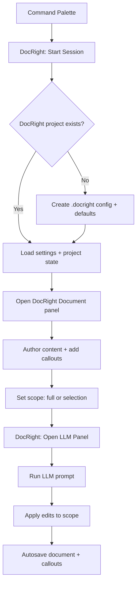
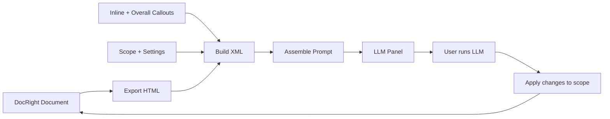

# DocRight

DocRight is a VS Code extension for structured document editing with scoped LLM callouts. It provides a rich-text editor, persistent project files, and a prompt pipeline that can apply edits to a selected scope of your document.

## Features
- Rich-text DocRight Document panel with tables, links, and inline formatting.
- Scoped editing (full document or selection-based) to constrain LLM edits.
- Inline and overall callouts that become structured edit instructions.
- LLM panel that builds a DocRight prompt from document + callouts.
- Search with highlighted matches and next/previous navigation.

## Quick Start (Local Development)
1) Open this folder in VS Code: `~/workspace/DocRight`
2) Build:
```
eval "$(fnm env)"
npm install
npm run compile
```
3) Start the Extension Development Host: `F5`
4) In the host window, run `DocRight: Start Session`

## Commands
- `DocRight: Start Session` (creates a DocRight project if needed)
- `DocRight: Open Editor`
- `DocRight: Open LLM Panel`
- `DocRight: Set Scope to Selection`
- `DocRight: Set Scope to Full Document`

## User Flow (Document Session)


## User Flow (Prompt Pipeline)


## Project Files
- `.docright/settings.json` - user-editable settings.
- `.docright/docright.json` - project config.
- `.docright/prompts/` - prompt preambles.
- `.docright/llm/` - LLM session metadata + last run.
- `document.lexical.json` - document editor state.
- `callouts.json` - inline + overall callouts.
- `contexts.json` - saved context items.
- `scope.json` - current scope selection.

## Development Scripts
- Build (includes webview bundle): `npm run compile`
- Webview bundle only: `npm run build:docright`
- Lint: `npm run lint`
- Test: `npm test`

## Notes
- The DocRight editor webview is bundled into `media/docright-editor.js`.
- If the search bar does not appear, rebuild with `npm run compile` and reopen the editor panel.
